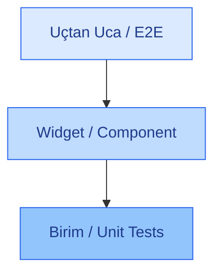
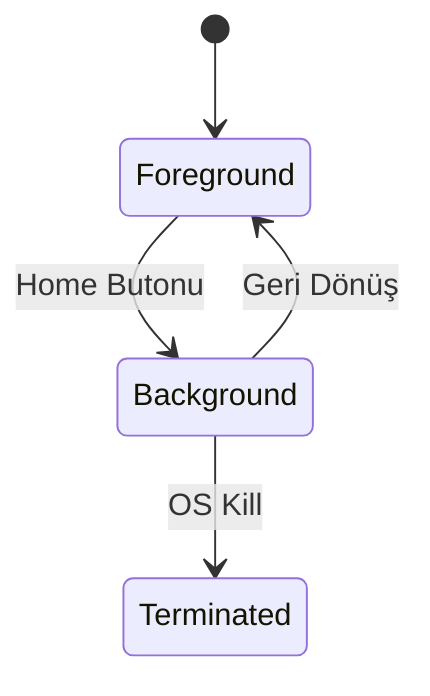
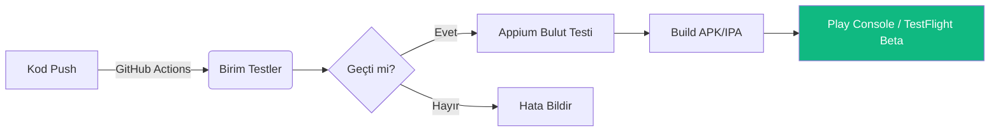

<!-- KAPAK SAYFASI (GÖSTERİŞLİ) -->

  <h1 class="cover-title">Mobil Uygulama Testlerinde   Modern Yaklaşımlar</h1>
  
  

  

    Cihaz Fragmantasyonundan Mağaza Onay Süreçlerine   Uçtan Uca Kalite Güvencesi
  

  
Sunan: [İsminiz]

  
Yazılım Test Süreçleri Dersi

---
layout: default
---

# Gündem ve Yol Haritası
Mobil test süreçlerini 4 ana eksende inceleyeceğiz.

  

    <h3 class="text-blue-700 mb-2">1. Ortam ve Karmaşıklık</h3>
    <ul class="text-sm">
      <li>Mobil Ekosistemin Doğası</li>
      <li>Test Piramidi</li>
      <li>Gerçek Cihaz vs. Simülatör</li>
    </ul>
  

  

    <h3 class="text-blue-700 mb-2">2. Senaryo Bazlı Testler</h3>
    <ul class="text-sm">
      <li>Yaşam Döngüsü (Lifecycle)</li>
      <li>Kesinti (Interrupt) Testleri</li>
      <li>Ağ ve Bağlantı Senaryoları</li>
    </ul>
  

  

    <h3 class="text-blue-700 mb-2">3. Performans ve Güvenlik</h3>
    <ul class="text-sm">
      <li>Donanım ve Kaynak Tüketimi</li>
      <li>Kullanıcı Deneyimi (UX)</li>
      <li>Veri Güvenliği</li>
    </ul>
  

  

    <h3 class="text-blue-700 mb-2">4. Süreç ve Dağıtım</h3>
    <ul class="text-sm">
      <li>Mağaza İnceleme Süreçleri</li>
      <li>Vaka Analizleri</li>
      <li>Otomasyon ve CI/CD</li>
    </ul>
  

---
layout: two-cols
---

# Mobil Ekosistemin Doğası

Grup 6: Yazılım Karmaşıklığı'na Atıfla

Mobil cihazlar, web tarayıcılarından farklı olarak donanıma sıkı sıkıya bağlı bir entropi yaratır.

- **OS Fragmantasyonu:** Android pazarındaki binlerce farklı cihaz/marka vs. iOS'in kapalı ancak sürümler arası farklı yapısı.
- **Ekran ve Çözünürlük:** Farklı en-boy oranları (notch, dinamik ada) ve piksel yoğunlukları.
- **Donanım:** Farklı işlemci mimarileri, GPU kapasiteleri ve sensörler.

::right::

  <h3 class="font-bold text-lg mb-4 text-center">Karmaşıklık Yönetimi</h3>
  
Cihaz çeşitliliğinin yarattığı test kombinasyonları eksponansiyel olarak artar. Bu durum, <b>Risk Tabanlı Test (RBT)</b> stratejilerini zorunlu kılar.

---

# Test Piramidi ve Mobil Uygulamalar
Modern mobil mimaride testlerin katmanlı yapısı.

  

  

  

    

      <b>Birim Testler (Unit):</b> İş mantığının (business logic) ve API isteklerinin dışa bağımlı olmadan doğrulanması.
    

    

      <b>Widget Testleri:</b> Arayüz bileşenlerinin (Örn: Flutter, React Native) bağımsız çalışabilirliği.
    

    

      <b>Uçtan Uca (E2E):</b> Appium gibi araçlarla gerçek kullanıcı akışlarının uçtan uca simülasyonu.
    

  

---

# Gerçek Cihaz mı, Emülatör mü?
Test ortamı seçimi projenin bütçesini ve hızını doğrudan etkiler.

  

    

      
💻

      <h3 class="text-lg font-bold">Emülatör / Simülatör</h3>
    

    <ul class="text-sm space-y-2">
      <li><b>Avantaj:</b> Hızlı kurulur, maliyetsizdir, CI/CD pipeline'larına kolay entegre olur.</li>
      <li><b>Dezavantaj:</b> Gerçek işlemci mimarisini yansıtmaz. GPS, kamera, donanım testlerinde yetersizdir.</li>
      <li><b>Kullanım:</b> UI testleri ve geliştirme aşaması.</li>
    </ul>
  

  

    

      
📱

      <h3 class="text-lg font-bold">Gerçek Cihaz (Real Device)</h3>
    

    <ul class="text-sm space-y-2">
      <li><b>Avantaj:</b> Kesin sonuç verir. Batarya tüketimi, ısınma, bellek yönetimi (OS Kill) sadece burada ölçülebilir.</li>
      <li><b>Dezavantaj:</b> Temini pahalıdır, bakımı zordur, laboratuvar gerektirir.</li>
      <li><b>Kullanım:</b> Performans testleri ve canlı öncesi son onay.</li>
    </ul>
  

Strateji: Hibrit Yaklaşım (Kritik senaryolar cihazda, diğerleri emülatörde)

---
layout: two-cols
---

# Yaşam Döngüsü (Lifecycle)
Uygulamanın durumu işletim sistemi tarafından sürekli değiştirilir.

- **Durum Yönetimi (State):** 
  Uygulama arka plana (Background) atıldığında veriler kayboluyor mu? Tekrar öne (Foreground) alındığında oturum aktif mi?
- **Sistem Müdahalesi (OS Kill):** 
  İşletim sistemi RAM'i boşaltmak için arkaplandaki uygulamayı acımasızca kapatır. Kullanıcı geri döndüğünde baştan mı başlıyor?
- **Açılış Performansı:** 
  - *Cold Start:* Sıfırdan açılış hızı.
  - *Warm Start:* Arkaplandan geri dönüş hızı.

::right::

  
Model Tabanlı Test Yaklaşımı

---

# Kesinti (Interrupt) Testleri
Mobil cihazlar "iletişim" aracıdır, testler bu gerçeğe göre yapılmalıdır.

  
Bir kullanıcı uygulamada kritik bir işlem yaparken (Örn: Ödeme onayı veya form doldurma) dışarıdan gelen bir kesintinin uygulamayı çökertmemesi gerekir.

  
  

    

      <h4 class="font-bold text-blue-700">Yaygın Kesintiler</h4>
      <ul class="text-sm mt-2">
        <li>Gelen GSM araması veya SMS</li>
        <li>WhatsApp / Anlık Bildirimler (Push)</li>
        <li>Alarm çalması</li>
        <li>%10 / %20 Düşük Pil Uyarısı</li>
      </ul>
    

    

      <h4 class="font-bold text-red-700">Beklenen Davranış</h4>
      <ul class="text-sm mt-2">
        <li>İşlem beklemeye (pause) alınmalı.</li>
        <li>Uygulama kesinlikle <b>crash olmamalı</b>.</li>
        <li>Kesinti bitince işlem kaldığı yerden devam etmeli.</li>
      </ul>
    

  

---

# Ağ ve Bağlantı Senaryoları
Bağlantı her zaman sabit ve mükemmel değildir.

- **Bant Genişliği Geçişleri:** 
  Kullanıcı asansöre bindiğinde 5G'den Edge'e (zayıf internet) düşen bağlantıda uygulama donuyor mu (Timeout)?
- **Ağ Değişimi (Handover):** 
  Evden çıkarken Wi-Fi'dan hücresel veriye (Cellular) geçişte güvenlik oturumu (Session) kopuyor mu?
- **Çevrimdışı (Offline) Mod:** 
  Uygulama internet yokken de temel işlevlerini yerine getirebilmeli.

  <b>Mühendislik Çözümü:</b> Çevrimdışı yapılan form veya kargo teslim işlemlerinin, cihaz internete bağlandığı anda arka planda veritabanı (SQLite/Room) ile otomatik senkronize edilmesinin test edilmesi.

---

# Donanım ve Sensör Entegrasyonu
Masaüstü yazılımlarında olmayan "fiziksel dünya" bağımlılıkları.

  

    
📍

    <h3 class="font-bold text-sm mb-2">Lokasyon (GPS)</h3>
    
Hareket halindeki lojistik uygulamalarının sahte lokasyonlara (Mock Location) ve arka plan kısıtlamalarına tepkisi.

  

  
  

    
👁️

    <h3 class="font-bold text-sm mb-2">Biyometrik Veri</h3>
    
FaceID ve TouchID ile login süreçlerinde şifreleme ve sahte yüz/parmak izi reddetme yetenekleri.

  

  

    
📸

    <h3 class="font-bold text-sm mb-2">Kamera & İzinler</h3>
    
Kamera açılış süresi, galeri erişim izinlerinin reddedilmesi durumunda uygulamanın hata yönetimi (Error Handling).

  

---

# Performans ve Kaynak Tüketimi
Bir uygulamanın "çalışması" yeterli değildir, cihazı "öldürmemelidir".

  

    
🔋

    

      <h4 class="font-bold text-slate-800">Batarya Tüketimi (Battery Drain)</h4>
      
Arka planda çalışan servislerin (özellikle GPS ve Bluetooth polling) pili sömürme hızı.

    

  

  
  

    
🧠

    

      <h4 class="font-bold text-slate-800">Bellek Sızıntısı (Memory Leak)</h4>
      
Uygulama açık kaldıkça RAM tüketiminin artması. Çöp toplayıcının (Garbage Collector) çalışamadığı durumların tespiti.

    

  

  

    
🔥

    

      <h4 class="font-bold text-slate-800">CPU ve Isınma (Thermal Throttling)</h4>
      
Aşırı işlemci yükü cihazı ısıttığında, işletim sisteminin frekans düşürmesi sonucu oluşan takılmalar (lag).

    

  

---

# Kullanıcı Deneyimi (UX) ve Erişilebilirlik
Mobil arayüz, insan parmağına ve özel gereksinimlere göre test edilmelidir.

- **Dokunmatik Jestler (Gestures):** 
  Uzun basma (Long press), çift tıklama (Double tap), ve kaydırma (Swipe) eylemlerinin algılanma hassasiyeti.
- **Erişilebilirlik (Accessibility - a11y):** 
  - Görme engelli kullanıcılar için ekran okuyucuların (iOS VoiceOver, Android TalkBack) buton etiketlerini doğru okuması.
  - İşletim sisteminden font büyütüldüğünde tasarımın bozulmaması (Responsive Text).
- **Ergonomi ve Kullanılabilirlik:** 
  Kritik butonların "tek elle kullanıma" uygun bölgelerde (ekranın alt kısmı) yer alması.

---

# Güvenlik Testleri
Taşınabilir cihazlar fiziksel ve dijital hırsızlığa en açık platformlardır.

  

    <h4 class="font-bold text-red-700 border-b border-slate-200 pb-2 mb-2">Veri Depolama</h4>
    
Hassas veriler (Token, Parola) asla düz metin (plain text) olarak kaydedilmemeli. iOS'te <b>Keychain</b>, Android'de <b>Encrypted SharedPreferences</b> kullanılmalı.

  

  
  

    <h4 class="font-bold text-red-700 border-b border-slate-200 pb-2 mb-2">Tersine Mühendislik</h4>
    
Kötü niyetli kişilerin APK/IPA kodlarını okumasını zorlaştırmak için kod karartma (Obfuscation) işleminin yapılması.

  

  
  

    <h4 class="font-bold text-red-700 mb-2">API ve Trafik Güvenliği</h4>
    
Sunucu ile istemci arasındaki iletişimin araya girme saldırılarına (Man in the Middle) karşı <b>SSL Pinning</b> mimarisi ile korunması.

  

---

# Mağaza İnceleme (Store Review) Süreçleri
Kodun hatasız olması, uygulamanın yayınlanacağı anlamına gelmez.

- **Apple ve Google Kriterleri:** 
  Mağazaların katı tasarım (Human Interface Guidelines), gizlilik ve veri toplama kurallarına uyumluluk kontrolü.
- **Yasal ve Teknik Belgeler:** 
  Özellikle finans veya devlet (Belediye) uygulamalarında, mağaza yetkililerine uygulamanın resmi bir kuruma ait olduğunu kanıtlayan **"Authorization Letter" (Yetki Belgesi)** sunulması zorunluluğu.
- **Yaygın Red (Reject) Sebepleri:** 
  - Eksik meta veri (yanlış ekran görüntüleri).
  - Kullanıcıdan gereksiz donanım izni (örn: fener uygulaması için lokasyon) istenmesi.
  - İnceleme ekibi test ederken yaşanan herhangi bir "Crash" durumu.

---
layout: two-cols
---

# Vaka Analizleri
Gerçek dünya projelerinde karşılaşılan mobil test zorlukları.

  <h4 class="font-bold text-blue-800 text-lg mb-2">Senaryo 1: Belediye Uygulaması</h4>
  
<b>Durum:</b> Resmi evrak yükleme ve e-devlet entegrasyonu barındıran hizmet uygulaması.

  
<b>Zorluk:</b> Apple inceleme ekibinin (Amerika) Türkiye e-devlet sistemine girememesi. Özel test hesapları ve ekran kayıt videoları (Demo Video) gönderilerek süreç aşıldı.

::right::

  <h4 class="font-bold text-red-800 text-lg mb-2">Senaryo 2: Kargo Takip</h4>
  
<b>Durum:</b> Kuryenin konumunu merkeze ileten lojistik uygulaması.

  
<b>Zorluk:</b> Kurye ekranı kilitlediğinde uygulamanın uyku moduna geçerek (Doze Mode) GPS'i kapatması.

  
<b>Çözüm:</b> "Foreground Service" yaşam döngüsü optimize edilerek sorun çözüldü.

---

# Mobil Test Otomasyonu
Sürekli tekrar eden testleri kodla ifade etme sanatı.

  

    <h4 class="font-bold text-lg">Appium</h4>
    
Cross-platform otomasyon için endüstri standardı. Tek kod tabanı ile hem iOS hem Android test edilebilir.

  

  

    <h4 class="font-bold text-lg">Espresso</h4>
    
Android'in yerel test framework'ü. Arayüz elemanlarıyla senkronize çalıştığı için çok hızlı ve kararlıdır.

  

  

    <h4 class="font-bold text-lg">XCUITest</h4>
    
Apple'ın iOS için resmi framework'ü. Swift dilinde yazılır ve iOS simülatörleri ile tam uyum sağlar.

  

  <b>Mühendislik Zorluğu (Flakiness):</b> Mobil testler asenkrondur (animasyonlar, API gecikmeleri). "Flaky" (bazen geçip bazen kalan) testleri önlemek için statik süre (sleep) yerine dinamik beklemeler (Explicit Waits) yazılmalıdır.

---

# Bulut Cihaz Çiftlikleri (Device Farms)
Gerçek cihaz testlerini ofisten buluta taşıyan mimari.

  

    
Kendi ofisinizde yüzlerce telefonu barındırmak yerine, AWS veya Google veri merkezlerindeki gerçek telefonlara uzaktan bağlanma sistemidir.
 
    <ul class="text-sm space-y-3">
      <li><b>Platformlar:</b> AWS Device Farm, Firebase Test Lab, BrowserStack.</li>
      <li><b>Otomasyon Entegrasyonu:</b> Appium scriptlerinizi buluta yükleyip tek tıkla 50 farklı fiziksel cihazda paralel çalıştırabilirsiniz.</li>
      <li><b>Maliyet Analizi:</b> Cihazların eskimemesi, batarya şişme riskinin olmaması ve 7/24 erişilebilirlik operasyon maliyetlerini düşürür.</li>
    </ul>
  

---

# Sürekli Entegrasyon (CI/CD)
Kodun yazımından mağazaya gidişine kadarki üretim bandı.

Her "Commit" ve "Push" sonrası insan eli değmeden otomatik testlerin koşturulması ve test ekibine <b>Beta dağıtım</b> yapılması sürecin kalbidir.

---
layout: two-cols
---

# Sonuç ve Gelecek Vizyonu
Mobil teknoloji evrimleşirken test yaklaşımları da değişiyor.

- **Yapay Zeka (AI) Destekli Testler:** 
  Test senaryolarının kod yazmadan (Scriptless) AI araçlarıyla oluşturulması. Görsel (Visual) regresyon hatalarını AI'ın milisaniyeler içinde fark etmesi.
- **Yeni Form Faktörleri:** 
  Katlanabilir cihazlar (Foldables), giyilebilir teknolojiler (Smartwatches) ve AR/VR gözlüklerinin (Apple Vision Pro) test süreçlerine entegrasyonu.

::right::

  <h3 class="font-bold text-xl mb-4">Özetle</h3>
  
Mobil test, sadece ekrana dokunmak değildir.  Yazılım karmaşıklığını yöneten, donanımla uyumlu çalışan ve katı mağaza kurallarından geçen bir <b>mühendislik stratejisidir</b>.

---

# Referanslar ve Kaynakça

Akademik ve Endüstriyel Kaynaklar:

1. **ISTQB®** (International Software Testing Qualifications Board) - *Mobile Application Testing Foundation Level Syllabus*.
2. **Apple Developer Documentation** - *App Store Review Guidelines* ve *Human Interface Guidelines*.
3. **Google Play Console Help** - *Developer Policy Center* ve Android Vitals Core Metrics.
4. **Ders Notları:** "Yazılım Test Mühendisliği" (Risk ve Karmaşıklık Modelleri).
5. **Appium Official Documentation** (appium.io).

---
layout: center
class: text-center
---

<h1 style="font-size: 4rem !important; color: #1E293B !important; margin-bottom: 96;">Teşekkürler</h1>

Sorularınız & Tartışma

  
#MobileTesting

  
#QualityAssurance

  
#SoftwareEngineering

Bu sunum GitHub Actions ve Slidev altyapısı kullanılarak kod tabanlı (as-code) hazırlanmıştır.
