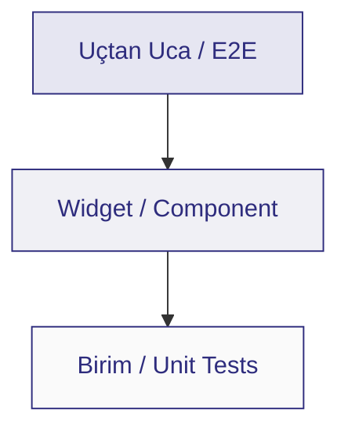
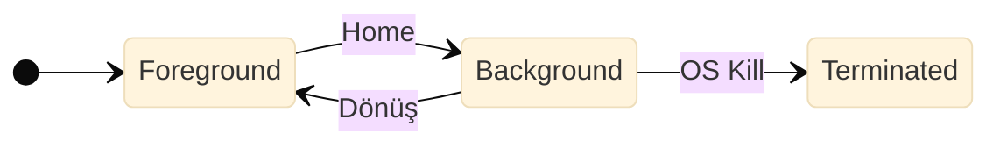
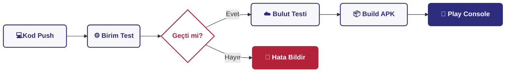

<style>
.slidev-layout {
  background-image: url("data:image/svg+xml,%3Csvg xmlns='http://www.w3.org/2000/svg' viewBox='0 0 980 552'%3E%3Crect width='980' height='552' fill='%23FAF4F4'/%3E%3Cpolygon points='480,0 600,0 640,40 520,40' fill='%232e2c7d'/%3E%3Cpolygon points='640,512 760,512 720,552 600,552' fill='%23b32238'/%3E%3Cpolygon points='780,512 900,512 940,552 820,552' fill='%232e2c7d'/%3E%3Crect x='40' y='40' width='900' height='472' fill='%23FFFFFF' stroke='%23222222' stroke-width='1.5'/%3E%3Crect x='41' y='462' width='898' height='49' fill='%232e2c7d' opacity='0.25'/%3E%3C/svg%3E");
  background-size: cover;
  background-position: center;
  padding: 60px 60px 100px 60px !important; 
  color: #1a1a1a;
}

h1, h2, h3, h4, h5 {
  font-family: 'Montserrat', sans-serif !important;
  color: #2e2c7d !important; 
}

h1 { font-weight: 800 !important; font-size: 2.2rem !important; line-height: 1.2; margin-bottom: 0.2rem; }
h3 { font-weight: 700 !important; font-size: 1.2rem !important; }
p, li { font-weight: 500; line-height: 1.5; color: #333; }

.text-red { color: #b32238 !important; }
.text-blue { color: #2e2c7d !important; }
.bg-red { background-color: #b32238 !important; color: white; }
.bg-blue { background-color: #2e2c7d !important; color: white; }

.card {
  background: #FFFFFF;
  border: 1px solid rgba(46, 44, 125, 0.1);
  border-left: 4px solid #b32238; 
  padding: 0.8rem 1rem;
  box-shadow: 2px 4px 12px rgba(0, 0, 0, 0.04);
}

.highlight-box {
  background: rgba(46, 44, 125, 0.05);
  border-left: 4px solid #2e2c7d;
  padding: 0.6rem 0.8rem;
  margin-top: 0.6rem;
  font-size: 0.85rem;
}

table {
  width: 100%;
  border-collapse: collapse;
  margin-top: 0.5rem;
  font-size: 0.75rem;
}
th { background-color: #2e2c7d; color: white; padding: 6px; text-align: left; }
td { padding: 6px; border-bottom: 1px solid #ddd; }
tr:nth-child(even) { background-color: #f9f9fc; }

.footer-text {
  position: absolute;
  bottom: 56px;
  left: 60px;
  right: 60px;
  color: #1a1a1a;
  font-weight: 600;
  font-size: 0.65rem;
  display: flex;
  justify-content: space-between;
  z-index: 10;
  opacity: 0.8;
}
</style>

<div class="mt-8">
  <!-- ŞIK GRUP 7 ETİKETİ -->
  <div class="inline-block px-3 py-1 mb-4 bg-[#eef1ff] border border-[#2e2c7d] text-blue text-[0.75rem] font-bold tracking-widest uppercase rounded shadow-sm">
    Grup 7 Sunumu
  </div>

  <h1 style="font-size: 3.5rem !important; line-height: 1.1; margin-bottom: 0;">Mobil Uygulama Testleri</h1>
  
  <div class="mt-5 mb-5 h-1.5 w-32 bg-red rounded-full shadow-sm"></div>

  <p class="text-[1.15rem] font-bold text-blue tracking-wide">
    Modern Yaklaşımlar, Cihaz Fragmantasyonu <br> ve Uçtan Uca Kalite Güvencesi
  </p>
</div>

<div class="footer-text">
  <span>Sunan: Grup 7 &nbsp;|&nbsp; Mobil Uygulama Testleri</span>
  <span>Yazılım Test Süreçleri Dersi</span>
</div>

---
layout: default
---

# Gündem ve Yol Haritası
Mobil test süreçlerini 4 ana eksende inceleyeceğiz.

<div class="grid grid-cols-2 gap-4 mt-6">
  <div class="card">
    <h3 class="mb-1">1. Ortam ve Karmaşıklık</h3>
    <ul class="text-[0.8rem] mt-1 space-y-1">
      <li>Mobil Ekosistemin Doğası</li>
      <li>Test Piramidi</li>
      <li>Gerçek Cihaz vs. Simülatör</li>
    </ul>
  </div>
  <div class="card">
    <h3 class="mb-1">2. Senaryo Bazlı Testler</h3>
    <ul class="text-[0.8rem] mt-1 space-y-1">
      <li>Yaşam Döngüsü (Lifecycle)</li>
      <li>Kesinti (Interrupt) Testleri</li>
      <li>Ağ ve Bağlantı Senaryoları</li>
    </ul>
  </div>
  <div class="card" style="border-left-color: #2e2c7d;">
    <h3 class="mb-1">3. Performans ve Güvenlik</h3>
    <ul class="text-[0.8rem] mt-1 space-y-1">
      <li>Donanım ve Kaynak Tüketimi</li>
      <li>Kullanıcı Deneyimi (UX)</li>
      <li>Veri Güvenliği</li>
    </ul>
  </div>
  <div class="card" style="border-left-color: #2e2c7d;">
    <h3 class="mb-1">4. Süreç ve Dağıtım</h3>
    <ul class="text-[0.8rem] mt-1 space-y-1">
      <li>Mağaza İnceleme Süreçleri</li>
      <li>Vaka Analizleri</li>
      <li>Otomasyon ve CI/CD</li>
    </ul>
  </div>
</div>

<div class="footer-text">
  <span>Gündem</span>
  <span>Bölüm 1</span>
</div>

---
layout: default
---

# Mobil Ekosistemin Doğası
<p class="text-sm text-red font-bold mb-4">Grup 6: Yazılım Karmaşıklığı'na Atıfla</p>

<div class="grid grid-cols-2 gap-8">
  <div>
    <p class="text-[0.85rem] mb-4">Mobil cihazlar, donanıma sıkı sıkıya bağlı bir entropi yaratır.</p>
    <ul class="text-[0.8rem] space-y-2 pr-2">
      <li><b>OS Fragmantasyonu:</b> Android pazarındaki binlerce farklı cihaz vs. iOS'in sürümler arası farklı yapısı.</li>
      <li><b>Ekran ve Çözünürlük:</b> Farklı en-boy oranları ve piksel yoğunlukları.</li>
      <li><b>Donanım:</b> Farklı işlemci mimarileri, GPU kapasiteleri ve sensörler.</li>
    </ul>
  </div>
  
  <div class="card" style="border-left-color: #2e2c7d; border-top: 4px solid #2e2c7d;">
    <h3 class="text-lg mb-2 text-center">Karmaşıklık Yönetimi</h3>
    <p class="text-[0.8rem] text-center">Cihaz çeşitliliğinin yarattığı test kombinasyonları eksponansiyel olarak artar. Bu durum, <b class="text-red">Risk Tabanlı Test (RBT)</b> stratejilerini zorunlu kılar.</p>
  </div>
</div>

<div class="footer-text">
  <span>Mobil Ekosistem</span>
  <span>Bölüm 1</span>
</div>

---
layout: default
---

# Test Piramidi ve Mobil Uygulamalar
Modern mobil mimaride testlerin katmanlı yapısı.

<div class="grid grid-cols-2 gap-8 mt-6 items-center">
  <div>



  </div>
  <div class="space-y-3">
    <div class="highlight-box">
      <b class="text-blue">Birim Testler (Unit):</b> İş mantığının ve API isteklerinin dışa bağımlı olmadan doğrulanması.
    </div>
    <div class="highlight-box">
      <b class="text-blue">Widget Testleri:</b> Arayüz bileşenlerinin (Örn: Flutter) bağımsız çalışabilirliği.
    </div>
    <div class="highlight-box">
      <b class="text-blue">Uçtan Uca (E2E):</b> Appium gibi araçlarla gerçek kullanıcı akışlarının simülasyonu.
    </div>
  </div>
</div>

<div class="footer-text">
  <span>Test Piramidi</span>
  <span>Bölüm 1</span>
</div>

---
layout: default
---

# Gerçek Cihaz mı, Emülatör mü?
Test ortamı seçimi projenin bütçesini ve hızını doğrudan etkiler.

<div class="grid grid-cols-2 gap-6 mt-4">
  <div class="card">
    <h3 class="text-lg mb-2">💻 Emülatör / Simülatör</h3>
    <ul class="text-[0.8rem] space-y-2">
      <li><b>Avantaj:</b> Hızlı kurulur, CI/CD'ye kolay entegre olur.</li>
      <li><b>Dezavantaj:</b> Gerçek işlemci mimarisini yansıtmaz. Sensör testlerinde yetersizdir.</li>
      <li><b>Kullanım:</b> UI testleri ve geliştirme.</li>
    </ul>
  </div>

  <div class="card" style="border-left-color: #2e2c7d;">
    <h3 class="text-lg mb-2">📱 Gerçek Cihaz</h3>
    <ul class="text-[0.8rem] space-y-2">
      <li><b>Avantaj:</b> Kesin sonuç verir. Batarya, ısınma, bellek yönetimi ölçülebilir.</li>
      <li><b>Dezavantaj:</b> Temini pahalıdır, bakımı zordur.</li>
      <li><b>Kullanım:</b> Performans testleri ve canlı öncesi onay.</li>
    </ul>
  </div>
</div>

<p class="text-center mt-4 text-[0.85rem] font-bold text-red">Strateji: Hibrit Yaklaşım (Kritik senaryolar cihazda, diğerleri emülatörde)</p>

<div class="footer-text">
  <span>Test Ortamları</span>
  <span>Bölüm 1</span>
</div>

---
layout: default
---

# Emülatör vs Gerçek Cihaz (Canlı Hata Tespiti)

<div class="grid grid-cols-2 gap-4 mt-2">
  <div class="card !p-3">
    <h4 class="text-blue font-bold text-[0.9rem] mb-2 text-center">💻 Emülatör Görünümü</h4>
    <div class="flex gap-3 h-[240px]">
      <div class="w-1/2 bg-black rounded border border-[#ddd] overflow-hidden flex justify-center items-center">
        <video controls autoplay loop muted class="w-full h-full object-contain">
          <source src="/android-video.mp4" type="video/mp4">
        </video>
      </div>
      <div class="w-1/2 flex flex-col justify-center">
        <p class="text-[0.65rem] leading-snug mt-1">Uygulama arayüzü, emülatörün mükemmel sanal piksellerinde <b>tamamen sorunsuz</b> çalışıyor gibi görünüyor.</p>
        <p class="text-[0.65rem] leading-snug mt-2 text-slate-500">Tüm butonlar hizalı ve UI test otomasyonu (Appium) bu ekranda <b>"TEST PASSED"</b> sonucu verir.</p>
      </div>
    </div>
  </div>

  <div class="card !p-3" style="border-left-color: #b32238;">
    <h4 class="text-red font-bold text-[0.9rem] mb-2 text-center">📱 Gerçek Cihaz Görünümü</h4>
    <div class="flex gap-3 h-[240px]">
      <div class="w-1/2 bg-black rounded border border-[#ddd] overflow-hidden flex justify-center items-center">
        <video controls autoplay loop muted class="w-full h-full object-contain">
          <source src="/ios-video.mp4" type="video/mp4"> 
        </video>
      </div>
      <div class="w-1/2 flex flex-col justify-center">
        <p class="text-[0.65rem] leading-snug mt-1">Gerçek cihazın ekran çentiği (Notch) ve donanımsal kenar payları (Safe Area) nedeniyle <b>UI öğeleri üst üste biniyor.</b></p>
        <p class="text-[0.65rem] leading-snug mt-2 font-bold text-red">Çözüm:</p>
        <p class="text-[0.65rem] leading-snug mt-1">Bu yüzden UI (Arayüz) testleri yalnızca emülatörde bırakılamaz, mutlaka fiziksel cihazlarda doğrulanmalıdır.</p>
      </div>
    </div>
  </div>
</div>

<div class="footer-text">
  <span>Emülatör vs Gerçek Cihaz</span>
  <span>Bölüm 1</span>
</div>
---
layout: default
---

# Yaşam Döngüsü (Lifecycle)
Uygulama durumu işletim sistemi tarafından değiştirilir.

<div class="grid grid-cols-2 gap-8 mt-4">
  <div>
    <ul class="text-[0.8rem] space-y-3">
      <li><b>Durum Yönetimi (State):</b> Uygulama arka plana atıldığında veriler kayboluyor mu?</li>
      <li><b>Sistem Müdahalesi (OS Kill):</b> İşletim sistemi RAM'i boşaltmak için uygulamayı acımasızca kapatır.</li>
      <li><b>Açılış Performansı:</b> 
        <ul class="mt-1 ml-4 list-disc space-y-1">
          <li><i>Cold Start:</i> Sıfırdan açılış.</li>
          <li><i>Warm Start:</i> Arkaplandan dönüş.</li>
        </ul>
      </li>
    </ul>
  </div>
<div class="p-4 bg-gradient-to-r from-[#f9f9fc] to-[#eef1ff] rounded-xl border border-[#2e2c7d] shadow-md max-w-3xl mx-auto">
  <p class="text-[1rem] font-bold text-center text-[#2e2c7d] mb-1 tracking-wide">
    Model Tabanlı Yaklaşım
  </p>
  <p class="text-[0.8rem] text-center text-gray-600 mb-3 leading-tight">
    Durumlar bir state machine olarak modellenir.
  </p>



  </div>
</div>

<div class="footer-text">
  <span>Yaşam Döngüsü</span>
  <span>Bölüm 2</span>
</div>

---
layout: default
---

# Kesinti (Interrupt) Testleri
Mobil cihazlar "iletişim" aracıdır, testler buna göre yapılmalıdır.

<div class="mt-2 highlight-box">
  <p class="text-[0.85rem]">Bir kullanıcı kritik bir işlem yaparken dışarıdan gelen bir kesintinin uygulamayı çökertmemesi gerekir.</p>
</div>
  
<div class="grid grid-cols-2 gap-6 mt-4">
  <div class="card">
    <h4 class="text-blue font-bold">Yaygın Kesintiler</h4>
    <ul class="text-[0.8rem] mt-2 space-y-1">
      <li>Gelen GSM araması veya SMS</li>
      <li>WhatsApp / Anlık Bildirimler</li>
      <li>Düşük Pil Uyarısı</li>
    </ul>
  </div>
  <div class="card" style="border-left-color: #2e2c7d;">
    <h4 class="text-red font-bold">Beklenen Davranış</h4>
    <ul class="text-[0.8rem] mt-2 space-y-1">
      <li>İşlem beklemeye (pause) alınmalı.</li>
      <li>Uygulama <b>crash olmamalı</b>.</li>
      <li>Kesinti bitince işlem devam etmeli.</li>
    </ul>
  </div>
</div>

<div class="footer-text">
  <span>Kesinti Testleri</span>
  <span>Bölüm 2</span>
</div>

---
layout: default
---

# Ağ ve Bağlantı Senaryoları

<div class="grid grid-cols-12 gap-6 mt-2">
  
  <div class="col-span-3 flex flex-col items-center justify-center mt-2">
    <div class="card !p-1.5 shadow-lg border-t-4 border-t-red-600 bg-white relative flex justify-center">
      
    </div>
  </div>


  <div class="col-span-9 flex flex-col justify-center">
    <ul class="text-[0.8rem] space-y-3 pr-2 mb-0">
      <li class="leading-snug">
        <b class="text-blue">Bant Genişliği Geçişleri:</b> Kullanıcı asansöre bindiğinde 5G'den Edge'e (zayıf internet) düşen bağlantıda uygulamanın donmaması (Timeout Handling) gerekir.
      </li>
      <li class="leading-snug">
        <b class="text-blue">Ağ Değişimi (Handover):</b> Evden çıkarken Wi-Fi'dan hücresel veriye (Cellular) geçişte güvenlik oturumunun (Session) kopup kopmadığı test edilmelidir.
      </li>
      <li class="leading-snug">
        <b class="text-red">Çevrimdışı (Offline) Mod Yönetimi:</b> Yandaki görsel, kendi geliştirdiğimiz Kargo uygulamasından bir örnektir. Uçak modunda API isteği atıldığında uygulama <b>çökmez (Crash olmaz).</b> Bunun yerine <i>DioException</i> hatası yakalanarak kullanıcıya Snackbar ile kontrollü bilgi verilir.
      </li>
    </ul>
    <div class="mt-4 card bg-[#fcfcfc] !p-2.5">
      <p class="text-[0.7rem] m-0 leading-snug"><b class="text-blue">Mühendislik Çözümü:</b> Çevrimdışı yapılan işlemlerin (örn. kargo teslimatı), cihaz internete bağlandığı anda arka planda veritabanı ile otomatik senkronize edilmesinin test edilmesi.</p>
    </div>
  </div>

</div>

<div class="footer-text">
  <span>Ağ ve Bağlantı</span>
  <span>Bölüm 2</span>
</div>

---
layout: default
---

# Exploratory ve Monkey Testing
<p class="text-[0.9rem] font-semibold text-[#c65f6d] -mt-1 mb-5">
  Senaryosuz testin gücü: Otomasyonun göremediğini insan bulur.
</p>

<div class="grid grid-cols-2 gap-6 mt-4">

  <div class="bg-white rounded-2xl shadow-md border border-gray-200 p-5">
    <h4 class="text-[#2e2c7d] font-bold text-[1rem] mb-3">
      Exploratory Testing (Keşifsel)
    </h4>
    <p class="text-[0.75rem] text-slate-700 leading-relaxed mb-3">
      Önceden yazılmış senaryo olmadan, uzman tarafından özgürce kullanılarak hata aranması.
    </p>
    <ul class="text-[0.75rem] space-y-2 text-slate-700">
      <li><b>Ne Zaman:</b> Yeni özellik geldiğinde, otomasyon yokken.</li>
      <li><b>Önemi:</b> Kullanıcılar senaryoya uymaz; beklenmedik jestler ancak bu yöntemle yakalanır.</li>
    </ul>
  </div>

  <div class="bg-white rounded-2xl shadow-md border border-gray-200 p-5">
    <h4 class="text-[#b4233c] font-bold text-[1rem] mb-3">
      Monkey Testing (Rastgelelik)
    </h4>
    <p class="text-[0.75rem] text-slate-700 leading-relaxed mb-3">
      Android'in aracıyla uygulamaya rastgele dokunma olayları gönderilerek crash tespiti yapılır.
    </p>
    <div class="bg-[#f6f6fa] px-3 py-2 rounded-lg text-[0.68rem] font-mono border border-gray-200 text-[#333] shadow-sm mb-3">
      adb shell monkey -p com.app -v 10000
    </div>
    <ul class="text-[0.75rem] space-y-2 text-slate-700">
      <li><b>Avantaj:</b> Düşünülemeyen edge case'leri yakalar.</li>
      <li><b>Dezavantaj:</b> Hatanın nedenini tekrar üretmek zordur.</li>
    </ul>
  </div>

</div>

<div class="footer-text">
  <span>Test Yaklaşımları</span>
  <span>Bölüm 2</span>
</div>

---
layout: default
---

# Performans ve Kaynak Tüketimi
<p class="text-[0.95rem] text-gray-500 font-medium mb-5">
  Uygulamanın çalışması yetmez, cihazı yormamalıdır.
</p>

<div class="grid grid-cols-3 gap-4 mt-4">

  <div class="bg-white rounded-xl shadow-md border border-gray-200 p-4 min-h-[180px] flex flex-col">
    <div class="w-10 h-10 rounded-full bg-[#eef1ff] text-[#2e2c7d] font-bold flex items-center justify-center mb-3">
      01
    </div>
    <h4 class="text-[#2e2c7d] font-bold text-[0.85rem] mb-2">
      Batarya Tüketimi
    </h4>
    <p class="text-[0.72rem] text-gray-600 leading-relaxed">
      Arka planda çalışan servislerin (özellikle GPS ve Bluetooth) pili tüketme hızı.
    </p>
  </div>

  <div class="bg-white rounded-xl shadow-md border border-gray-200 p-4 min-h-[180px] flex flex-col">
    <div class="w-10 h-10 rounded-full bg-[#eef1ff] text-[#2e2c7d] font-bold flex items-center justify-center mb-3">
      02
    </div>
    <h4 class="text-[#2e2c7d] font-bold text-[0.85rem] mb-2">
      Bellek Sızıntısı
    </h4>
    <p class="text-[0.72rem] text-gray-600 leading-relaxed">
      Uygulama açık kaldıkça RAM tüketiminin artması, çöp toplayıcının çalışamadığı durumlar.
    </p>
  </div>

  <div class="bg-white rounded-xl shadow-md border border-gray-200 p-4 min-h-[180px] flex flex-col">
    <div class="w-10 h-10 rounded-full bg-[#eef1ff] text-[#2e2c7d] font-bold flex items-center justify-center mb-3">
      03
    </div>
    <h4 class="text-[#2e2c7d] font-bold text-[0.85rem] mb-2">
      CPU ve Isınma
    </h4>
    <p class="text-[0.72rem] text-gray-600 leading-relaxed">
      Aşırı işlemci yükünde cihazın frekans düşürmesi sonucu oluşan yavaşlamalar.
    </p>
  </div>

</div>

<div class="footer-text">
  <span>Performans</span>
  <span>Bölüm 3</span>
</div>

---
layout: default
---

# Bellek Performansı (Canlı Demo)
<p class="text-[0.85rem] font-bold text-red -mt-2 mb-2">
  Bir Memory Leak (Bellek Sızıntısı) olmadığını nasıl anlarız?
</p>

<div class="flex flex-row items-center justify-center gap-4 w-full">
  
  <!-- SOL: PROFILER VİDEOSU -->
  <div class="card !p-1.5 shadow-xl border-t-4 border-t-red-600 bg-[#1E1E1E] relative w-[48%] h-[230px] flex justify-center items-center">
    <video controls autoplay loop muted class="w-full h-full object-contain rounded">
      <source src="/profiler.mp4" type="video/mp4"> 
    </video>
  </div>

  <!-- SAĞ: AÇIKLAMA -->
  <div class="bg-[#f9f9fc] p-3 rounded-lg border border-[#2e2c7d] w-[42%] shadow-sm">
    <h4 class="text-[0.8rem] font-bold text-blue mb-2">
      Flutter DevTools (Memory Profiler)
    </h4>
    <p class="text-[0.7rem] m-0 text-slate-700 leading-snug">
      Kendi projemizi test ederken yakaladığımız bellek (Heap) tüketim grafiği.
      Mor simgeler <b>Garbage Collector (Çöp Toplayıcı)</b> faaliyetlerini gösterir.
      Alttaki çizginin stabil kalması (~40MB), uygulamamızda cihazı donduracak
      bir <b>Memory Leak</b> olmadığını mühendislik verileriyle kanıtlıyor.
    </p>
  </div>

</div>

<div class="footer-text">
  <span>Performans Demosu</span>
  <span>Bölüm 3</span>
</div>

---
layout: default
---

# Güvenlik Testleri
Taşınabilir cihazlar fiziksel ve dijital hırsızlığa açıktır.

<div class="grid grid-cols-2 gap-6 mt-4">
  <div class="card">
    <h4 class="text-red font-bold border-b border-[#eee] pb-1 mb-2">Veri Depolama</h4>
    <p class="text-[0.8rem]">Hassas veriler asla düz metin kaydedilmemeli. iOS'te <b>Keychain</b>, Android'de <b>Encrypted SharedPreferences</b> kullanılmalı.</p>
  </div>
  
  <div class="card" style="border-left-color: #2e2c7d;">
    <h4 class="text-blue font-bold border-b border-[#eee] pb-1 mb-2">Tersine Mühendislik</h4>
    <p class="text-[0.8rem]">Kötü niyetli kişilerin APK/IPA kodlarını okumasını zorlaştırmak için kod karartma (Obfuscation) yapılmalı.</p>
  </div>
  
  <div class="card col-span-2 text-center" style="border-left: none; border-top: 4px solid #b32238; padding: 0.8rem;">
    <h4 class="text-red font-bold mb-1">API ve Trafik Güvenliği</h4>
    <p class="text-[0.8rem]">Sunucu ile istemci arasındaki iletişimin araya girme saldırılarına (MitM) karşı <b>SSL Pinning</b> mimarisi ile korunması.</p>
  </div>
</div>

<div class="footer-text">
  <span>Güvenlik</span>
  <span>Bölüm 3</span>
</div>

---
layout: default
---

# Mağaza İnceleme (Store Review) Süreçleri
Kodun hatasız olması, uygulamanın yayınlanacağı anlamına gelmez.

<ul class="text-[0.85rem] space-y-3 mt-4">
  <li><b>Apple ve Google Kriterleri:</b> Mağazaların katı tasarım (Human Interface), gizlilik ve veri kurallarına uyumluluk kontrolü.</li>
  <li><b>Yasal ve Teknik Belgeler:</b> Özellikle finans veya devlet uygulamalarında, mağazaya uygulamanın resmi bir kuruma ait olduğunu kanıtlayan <b>"Authorization Letter" (Yetki Belgesi)</b> sunulması zorunluluğu.</li>
  <li><b>Yaygın Red (Reject) Sebepleri:</b>
    <ul class="mt-1 ml-4 space-y-1 text-[0.8rem] text-slate-700">
      <li>Eksik meta veri (yanlış ekran görüntüleri).</li>
      <li>Kullanıcıdan gereksiz donanım izni istenmesi.</li>
      <li>İnceleme ekibi test ederken yaşanan herhangi bir "Crash".</li>
    </ul>
  </li>
</ul>

<div class="footer-text">
  <span>Store Review</span>
  <span>Bölüm 3</span>
</div>

---
layout: default
---

<h1 style="font-size: 2.1rem !important; line-height: 1.1; margin-bottom: 0.5rem;">Lokalizasyon ve Uyumluluk <br><span style="font-size: 1.6rem; color: #b32238;">(i18n / L10n)</span></h1>

<p class="text-[0.85rem] font-bold text-blue mb-2">Uygulama çalışıyor olabilir — ama doğru dilde ve formatta mı?</p>

<div class="grid grid-cols-3 gap-4 mt-2">
  <div class="card p-3">
    <h4 class="text-blue font-bold text-[0.85rem] mb-1">1. Karakter Seti</h4>
    <ul class="text-[0.7rem] space-y-1">
      <li>Türkçe özel karakterlerin (ş, ğ, ü) veritabanına doğru okunması.</li>
      <li>Arapça/İbranice (RTL) dillerde arayüzün ters dönmesi.</li>
    </ul>
  </div>
  
  <div class="card p-3" style="border-left-color: #2e2c7d;">
    <h4 class="text-red font-bold text-[0.85rem] mb-1">2. Format Farklılıkları</h4>
    <ul class="text-[0.7rem] space-y-1">
      <li><b>Tarih:</b> 25.04.2026 (TR) vs 04/25/2026 (US).</li>
      <li><b>Para:</b> ₺1.250,99 vs $1,250.99</li>
      <li>Ödeme ekranlarında çökme yaratır.</li>
    </ul>
  </div>

  <div class="card p-3">
    <h4 class="text-blue font-bold text-[0.85rem] mb-1">3. Ekran Uyumu</h4>
    <ul class="text-[0.7rem] space-y-1">
      <li>Almanca gibi dillerde kelime/buton taşması.</li>
      <li>Sistem dilini değiştirerek <b>manuel test</b> zorunludur.</li>
    </ul>
  </div>
</div>

<div class="mt-4 highlight-box !border-l-[#f59e0b] !bg-[#fffbeb] p-2">
  <p class="text-[0.75rem]"><b class="text-[#b45309]">Kalite Sorunu:</b> Hedef pazarda yerelleştirilmemiş bir uygulama kullanıcı kaybeder. Bu bir kalite güvencesi sorunudur.</p>
</div>

<div class="footer-text">
  <span>Lokalizasyon</span>
  <span>Bölüm 3</span>
</div>

---
layout: default
---

# L10n Hatası (Canlı Demo)

<div class="grid grid-cols-2 gap-8 mt-4">
  <div class="card !p-3 flex gap-3 items-center">
    <div class="w-[35%]">
      
    </div>
    <div class="w-[65%]">
      <h4 class="text-blue font-bold text-[0.85rem] mb-1">Orijinal (TR) Görünüm</h4>
      <p class="text-[0.7rem] text-slate-700 leading-snug mt-2">Uygulama kendi orijinal dilinde (Türkçe) geliştirildiğinde tüm butonlar, metinler ve UI bileşenleri ekrana kusursuz şekilde oturur.</p>
    </div>
  </div>

  <div class="card !p-3 flex gap-3 items-center" style="border-left-color: #b32238;">
    <div class="w-[35%] relative">
      
      <div class="absolute -top-2 -right-2 bg-red text-white text-[0.5rem] font-bold px-1.5 py-0.5 rounded shadow animate-pulse">
        HATA!
      </div>
    </div>
    <div class="w-[65%]">
      <h4 class="text-red font-bold text-[0.85rem] mb-1">Çeviri Atlaması (Bug)</h4>
      <p class="text-[0.7rem] text-slate-700 leading-snug mt-1">Dil paketi (JSON/ARB) güncellenmediği için framework ilgili çeviriyi bulamaz.</p>
      <div class="mt-2 bg-[#fbebeb] border border-[#f5c6c6] p-1.5 rounded text-[0.55rem] font-mono text-red">
        RIGHT OVERFLOWED BY 98 PIXELS
      </div>
      <p class="text-[0.65rem] text-slate-500 mt-1">Sığmayan bileşenler UI Crash'e neden olur.</p>
    </div>
  </div>
</div>

<div class="footer-text">
  <span>Lokalizasyon Demosu</span>
  <span>Bölüm 3</span>
</div>

---
layout: two-cols
---

# Vaka Analizleri

<div class="mt-4 pr-4">
  <h4 class="text-blue font-bold mb-1">Senaryo 1: Belediye Uygulaması</h4>
  <p class="text-[0.85rem]"><b>Durum:</b> Bir devlet kurumu (belediye) için hazırlanan e-hizmet uygulamasının mağaza yayın süreci.</p>
  
  <p class="text-[0.85rem] mt-2"><b>Zorluk:</b> Apple'ın katı <i>Store Review</i> politikaları gereği, uygulamanın şahıs hesabı yerine doğrudan <b>Belediyenin resmi Kurumsal Apple Developer Hesabı (D-U-N-S Numaralı)</b> üzerinden yayınlanmasını şart koşması.</p>
  
  <p class="text-[0.85rem] mt-2"><b>Çözüm:</b> Belediyenin resmi onay belgeleri (Authorization Letter) İngilizceye çevrildi, kurumsal hesap doğrulama süreçleri yönetildi ve Apple test ekibine özel Demo hesapları sağlanarak bürokratik engel aşıldı.</p>
</div>

::right::

<div class="ml-4 mt-14 card">
  <h4 class="text-red font-bold mb-1">Senaryo 2: Kargo Takip</h4>
  <p class="text-[0.85rem]"><b>Durum:</b> Kuryenin konumunu merkeze ileten lojistik uygulaması.</p>
  <p class="text-[0.85rem] mt-2"><b>Zorluk:</b> Kurye ekranı kilitlediğinde uygulamanın uyku moduna geçerek (Doze Mode) GPS'i kapatması ve veri kaybı.</p>
  <p class="text-[0.85rem] mt-2"><b>Çözüm:</b> "Foreground Service" yaşam döngüsü ve batarya optimizasyonu testleri yapılarak sorun çözüldü.</p>
</div>

<div class="footer-text">
  <span>Vaka Analizleri</span>
  <span>Bölüm 4</span>
</div>

---
layout: default
---

# Canlı Demo: Appium Login
<p class="text-sm font-bold text-red -mt-2 mb-4">Mühendislik Pratikte Nasıl Görünür?</p>

<div class="grid grid-cols-2 gap-6">

  <div class="h-[290px] flex flex-col">
    <div class="bg-[#2D2D2D] text-[#ccc] px-3 py-1 text-[0.6rem] font-mono border border-[#404040] flex gap-2 items-center rounded-t-lg">
       <div class="w-2 h-2 rounded-full bg-[#ff5f56]"></div>
       <div class="w-2 h-2 rounded-full bg-[#ffbd2e]"></div>
       <div class="w-2 h-2 rounded-full bg-[#27c93f]"></div>
       <span class="ml-2">test_login.py</span>
    </div>

```python {class: '!m-0 !rounded-none !border !border-t-0 !border-[#404040] shadow-lg text-[0.65rem]'}
from appium import webdriver

def test_login(driver):
    user = driver.find_element_by_id("usr")
    btn = driver.find_element_by_id("btn")

    user.send_keys("admin")
    btn.click()

    assert driver.find_element_by_id("ok")
```
  </div>

<div class="bg-black text-[0.58rem] font-mono flex flex-col border border-[#333] shadow-lg rounded-lg overflow-hidden h-[290px]">
  
  <div class="bg-[#1a1a1a] text-[#aaa] px-2.5 py-1 flex justify-between items-center">
    <span>Terminal</span>
    <span class="text-[#27c93f] animate-pulse">● Running</span>
  </div>

  <div class="p-2 text-[#27c93f] space-y-0.5 leading-tight">
    <v-clicks>
      <p><span class="text-white">$</span> pytest test_login.py</p>
      <p class="text-[#aaa]">[Appium] Welcome</p>
      <p class="text-[#58a6ff]">INFO: Finding element...</p>
      <p class="text-[#58a6ff]">INFO: Sending keys...</p>
      <p class="text-[#58a6ff]">INFO: Clicking button...</p>
      <p class="text-[#d2a8ff]">WAIT: Waiting (150ms)</p>
      <p class="pt-1 text-[#27c93f] font-bold">=== 1 passed in 4.1s ===</p>
      <p class="text-white mt-1 bg-[#2ea043] px-2 py-0.5 inline-block font-sans font-bold rounded">
        ✅ BAŞARILI
      </p>
    </v-clicks>
  </div>
</div>
</div>

<div class="footer-text">
  <span>Canlı Demo</span>
  <span>Bölüm 4</span>
</div>

---
layout: default
---

# Bulut Cihaz Çiftlikleri (Device Farms)
Gerçek cihaz testlerini ofisten buluta taşıyan mimari.

<div class="mt-4 bg-[#f9f9fc] p-4 border border-[#e6e6e6] rounded">
  <p class="text-[0.85rem] mb-4">Kendi ofisinizde yüzlerce telefonu barındırmak yerine, kiralama modeliyle AWS veya Google veri merkezlerindeki gerçek telefonlara bağlanma sistemidir.</p>
  
  <ul class="text-[0.8rem] space-y-2 list-disc ml-4">
    <li><b>Platformlar:</b> AWS Device Farm, Firebase Test Lab, BrowserStack.</li>
    <li><b>Otomasyon Entegrasyonu:</b> Appium scriptlerini buluta yükleyip tek tıkla 50 farklı cihazda paralel çalıştırabilirsiniz.</li>
    <li><b>Maliyet Analizi:</b> Cihazların eskimemesi, batarya şişme riskinin olmaması ve 7/24 erişilebilirlik operasyonel maliyetleri ciddi oranda düşürür.</li>
  </ul>
</div>

<div class="footer-text">
  <span>Device Farms</span>
  <span>Bölüm 4</span>
</div>

---
layout: default
---

# Test Raporlama ve Metrikler
<p class="text-[0.85rem] font-bold text-red -mt-2 mb-3">Test ettik — peki sonucu nasıl ölçüyoruz?</p>

<div class="grid grid-cols-4 gap-2 mt-2 text-center">
  <div class="bg-[#f7f7fb] px-2 py-1.5 border border-[#ddd] rounded text-[0.6rem] font-bold text-blue shadow-sm">
    Crash Rate: <span class="text-gray-600 font-medium">&lt;%1</span>
  </div>
  <div class="bg-[#f7f7fb] px-2 py-1.5 border border-[#ddd] rounded text-[0.6rem] font-bold text-blue shadow-sm">
    ANR Rate: <span class="text-gray-600 font-medium">&lt;%0.47</span>
  </div>
  <div class="bg-[#f7f7fb] px-2 py-1.5 border border-[#ddd] rounded text-[0.6rem] font-bold text-blue shadow-sm">
    Coverage: <span class="text-gray-600 font-medium">%70+</span>
  </div>
  <div class="bg-[#f7f7fb] px-2 py-1.5 border border-[#ddd] rounded text-[0.6rem] font-bold text-blue shadow-sm">
    MTTD: <span class="text-gray-600 font-medium">dakika</span>
  </div>
</div>

<table class="mt-4 w-full">
  <tr>
    <th class="!py-1.5 !px-2 text-[0.75rem]">Araç</th>
    <th class="!py-1.5 !px-2 text-[0.75rem]">Ne İşe Yarar</th>
  </tr>
  <tr>
    <td class="!py-1.5 !px-2 text-[0.75rem]"><b>Firebase Crashlytics</b></td>
    <td class="!py-1.5 !px-2 text-[0.75rem]">Gerçek kullanıcı crash'lerini anlık raporlar.</td>
  </tr>
  <tr>
    <td class="!py-1.5 !px-2 text-[0.75rem]"><b>Sentry</b></td>
    <td class="!py-1.5 !px-2 text-[0.75rem]">Hem hata hem performans izleme, stack trace verir.</td>
  </tr>
  <tr>
    <td class="!py-1.5 !px-2 text-[0.75rem]"><b>Allure Report</b></td>
    <td class="!py-1.5 !px-2 text-[0.75rem]">Appium sonuçlarını görsel rapora dönüştürür.</td>
  </tr>
  <tr>
    <td class="!py-1.5 !px-2 text-[0.75rem]"><b>Android Vitals</b></td>
    <td class="!py-1.5 !px-2 text-[0.75rem]">Play Console içinde ANR ve crash dashboard'u.</td>
  </tr>
</table>

<div class="mt-3 highlight-box !py-2 !px-3">
  <p class="text-[0.7rem] leading-snug m-0">
    <b class="text-blue">Özet:</b> Raporlama olmadan test, veri olmadan karar vermektir. CI/CD entegrasyonlu raporlar hata trendini izlemeyi sağlar.
  </p>
</div>

<div class="footer-text">
  <span>Raporlama</span>
  <span>Bölüm 4</span>
</div>


---
layout: default
---

# Sürekli Entegrasyon (CI/CD)
<p class="text-[0.85rem] font-bold text-red -mt-2 mb-4">Kodun yazımından mağazaya gidişine kadarki üretim bandı.</p>

<div class="mt-2 py-4 bg-white border border-[#eee] rounded-xl shadow-sm flex justify-center items-center overflow-hidden">



</div>

<div class="mt-6 highlight-box !border-l-[#2e2c7d] p-3 text-center mx-auto w-[90%]">
  <p class="text-[0.85rem] m-0 leading-relaxed text-[#333]">
    Her <b class="text-blue">"Commit"</b> sonrası insan eli değmeden otomatik testlerin koşturulması ve test ekibine <b class="text-red">Beta dağıtım</b> yapılması sürecin kalbidir.
  </p>
</div>

<div class="footer-text">
  <span>CI/CD</span>
  <span>Bölüm 4</span>
</div>

---
layout: default
---

# Referanslar ve Kaynakça

Akademik ve Endüstriyel Kaynaklar:

1. **ISTQB®** - *Mobile Application Testing Foundation Level*.
2. **Apple Developer** - *App Store Review Guidelines*.
3. **Google Play** - *Developer Policy Center*.
4. **Ders Notları:** "Yazılım Test Mühendisliği" (Risk ve Karmaşıklık).
5. **Appium Docs** (appium.io).

<div class="footer-text">
  <span>Referanslar</span>
  <span>Bölüm 4</span>
</div>


---
layout: center
class: text-center
---

<div class="flex flex-col items-center justify-center mt-4">
  <h1 style="font-size: 4rem !important; line-height: 1 !important; margin-bottom: 1rem !important;">Teşekkürler</h1>
  
  <p class="text-[1.2rem] font-bold text-red mb-8">Sorularınız & Tartışma</p>

  <div class="z-10 relative">
    <a href="sunum.pdf" download="Mobil_Test_Sunumu.pdf" class="inline-flex items-center justify-center gap-2 px-5 py-2.5 bg-blue text-white font-bold shadow-lg hover:bg-opacity-90 transition-all cursor-pointer no-underline border-b-4 text-sm" style="border-color: #1a1854;">
      <svg xmlns="http://www.w3.org/2000/svg" width="18" height="18" viewBox="0 0 24 24"><path fill="currentColor" d="M12 16l-5-5h3V4h4v7h3l-5 5zm9-4v9H3v-9h2v7h14v-7h2z"/></svg>
      Sunumu PDF Olarak İndir
    </a>
  </div>
</div>

<p class="absolute bottom-20 left-0 right-0 text-[0.65rem] font-bold text-center" style="color: #1a1a1a;">Bu sunum GitHub Actions ve Slidev altyapısı kullanılarak kod tabanlı (as-code) hazırlanmıştır.</p>

<div class="footer-text">
  <span>Bitiş</span>
</div>