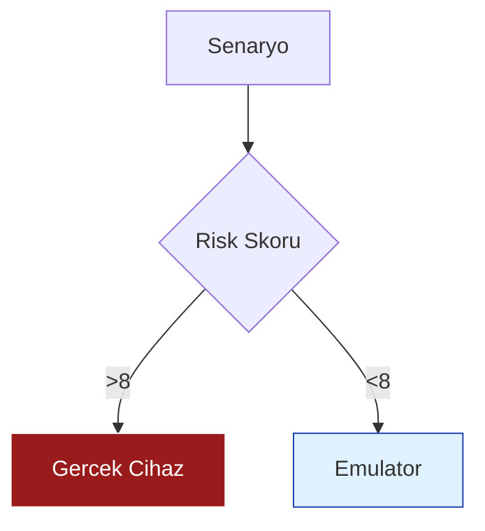

<style>
.slidev-layout {
  background: linear-gradient(135deg, #f0f9ff 0%, #e0f2fe 100%);
}

h1 {
  font-family: 'DM Serif Display', serif;
  background: linear-gradient(45deg, #991b1b, #1e40af);
  -webkit-background-clip: text;
  -webkit-text-fill-color: transparent;
  font-size: 3.5rem !important;
  font-weight: 800;
}

.glass-card {
  background: rgba(255, 255, 255, 0.6);
  backdrop-filter: blur(10px);
  border: 1px solid rgba(255, 255, 255, 0.3);
  border-radius: 1.5rem;
  padding: 2rem;
  box-shadow: 0 8px 32px 0 rgba(31, 38, 135, 0.07);
}

.tag-red {
  background: #991b1b;
  color: white;
  padding: 0.2rem 0.8rem;
  border-radius: 999px;
  font-size: 0.8rem;
  font-weight: bold;
}
</style>

# Mobil Testlerde <br> Mühendislik Stratejileri

<div class="mt-10 flex flex-col items-center shadow-sm">
  <p class="text-xl text-slate-600 font-medium tracking-wide">Mimari, Risk ve Karmaşıklık Yönetimi</p>
  <div class="h-1 w-24 bg-red-800 mt-4 rounded-full"></div>
</div>

<div class="abs-bl m-10 flex gap-3 italic text-sm text-slate-500">
  <span>Yazılım Test Süreçleri Sunumu</span>
</div>

---
layout: default
---

# Teorik Bağlam ve Bütünlük
<p class="text-slate-500 -mt-4">Önceki Haftaların Temelleri Üzerine İnşa Etmek</p>

<div class="grid grid-cols-3 gap-6 mt-10">
  <div class="glass-card border-t-4 border-blue-500">
    <div class="text-3xl mb-2">🧩</div>
    <h3 class="text-blue-900 font-bold">Karmaşıklık</h3>
    <p class="text-sm text-slate-600 italic">Grup 6</p>
    <p class="text-xs mt-2">Cihaz ve OS fragmantasyonunun yarattığı entropi.</p>
  </div>
  
  <div class="glass-card border-t-4 border-red-700">
    <div class="text-3xl mb-2">⚖️</div>
    <h3 class="text-red-900 font-bold">Risk Analizi</h3>
    <p class="text-sm text-slate-600 italic">Grup 10</p>
    <p class="text-xs mt-2">Kritik senaryoların önceliklendirilmesi.</p>
  </div>

  <div class="glass-card border-t-4 border-slate-700">
    <div class="text-3xl mb-2">🏗️</div>
    <h3 class="text-slate-800 font-bold">Modelleme</h3>
    <p class="text-sm text-slate-600 italic">Grup 11</p>
    <p class="text-xs mt-2">Uygulama yaşam döngüsü durum geçişleri.</p>
  </div>
</div>

---

# 1. Ekosistem Karmaşıklığı
<p class="text-slate-500 -mt-4">Mobil Test Neden "Zor" Bir Mühendislik Alanıdır?</p>

<div class="flex gap-8 mt-10">
  <div class="w-1/2">
    
  </div>
  <div class="w-1/2 space-y-6">
    <div class="flex items-start gap-4">
      <div class="bg-blue-100 p-2 rounded-lg text-blue-800">01</div>
      <div>
        <h4 class="font-bold text-slate-800">Donanım Bağımlılığı</h4>
        <p class="text-sm text-slate-600">Sensörler, GPS ve biyometrik verilerin simülasyon zorluğu.</p>
      </div>
    </div>
    <div class="flex items-start gap-4">
      <div class="bg-red-100 p-2 rounded-lg text-red-800">02</div>
      <div>
        <h4 class="font-bold text-slate-800">Ağ Dinamikleri</h4>
        <p class="text-sm text-slate-600">Bağlantı geçişleri (Handover) ve offline mod senkronizasyonu.</p>
      </div>
    </div>
    <div class="bg-white p-4 rounded-2xl border-l-4 border-red-800 shadow-sm">
      <p class="italic text-sm text-slate-700">"Mobil dünyada cihaz sayısı arttıkça, testlerin deterministik yapısı bozulur."</p>
    </div>
  </div>
</div>

---
layout: two-cols
---

# 2. Risk Bazlı Önceliklendirme
<span class="tag-red">STRATEJİ</span>

Uygulamanın en riskli noktalarını nasıl izole ederiz?

- **Yüksek Risk:** Ödeme, Auth, Push Bildirimleri.
- **Orta Risk:** Profil yönetimi, Arama filtreleri.
- **Düşük Risk:** Hakkımızda sayfası, Statik içerikler.

<div class="mt-10 p-4 bg-white rounded-2xl shadow-sm border border-slate-100">
  <h4 class="text-xs font-bold text-slate-400 uppercase tracking-widest mb-2">Ortam Seçimi</h4>
  <ul class="text-sm space-y-2 text-slate-600">
    <li>✅ <b>Emülatör:</b> UI ve Fonksiyonel testler.</li>
    <li>🚨 <b>Gerçek Cihaz:</b> Performans ve Isınma.</li>
  </ul>
</div>

::right::

<div class="ml-10 mt-20">

</div>

---

# 3. Kritik Kesinti (Interrupt) Testleri
<p class="text-slate-500 -mt-4">Kullanıcının En Hassas Olduğu Anlar</p>

<div class="grid grid-cols-2 gap-10 mt-10">
  <div class="glass-card relative overflow-hidden group">
    <div class="absolute top-0 right-0 p-4 bg-red-50 text-red-800 font-bold rounded-bl-2xl italic">Demo</div>
    <h3 class="font-bold mb-4">Arama ve SMS Kesintisi</h3>
    <p class="text-sm text-slate-600">Tam ödeme anında gelen bir çağrı uygulamanın state'ini bozuyor mu?</p>
    <div class="mt-6 h-32 bg-slate-100 rounded-xl flex items-center justify-center text-slate-400 border-2 border-dashed border-slate-200">
      [VIDEO: Interrupt-Demo.mp4]
    </div>
  </div>

  <div class="glass-card">
    <h3 class="font-bold mb-4 text-blue-900">Bağlantı Geçişleri</h3>
    <p class="text-sm text-slate-600">4G -> No Signal -> WiFi geçişlerinde veri paketleri nasıl yönetiliyor?</p>
    <ul class="mt-4 text-xs space-y-2 text-slate-500 leading-relaxed">
      <li>• Retry Mechanism testleri.</li>
      <li>• Timeout (Zaman aşımı) yönetimi.</li>
      <li>• Veri bütünlüğü (Checksum) kontrolleri.</li>
    </ul>
  </div>
</div>

---

# 4. Kod: Modern Otomasyon Mimarisi
<p class="text-slate-500 -mt-4">Appium ve Page Object Model (POM)</p>

```python {all|4-6|8-11|13-15}
# test_payment_interrupt.py
from appium import webdriver

class TestMobileEngineering:
    def setup_method(self):
        self.driver = webdriver.Remote("http://localhost:4723/wd/hub", caps)

    def test_payment_stability_during_call(self):
        # 1. Ödeme butonuna odaklan
        payment_btn = self.driver.find_element_by_id("pay_now")
        payment_btn.click()

        # 2. Kesinti Oluştur (Mühendislik Simülasyonu)
        self.driver.make_gsm_call("5550001122", "signal_strength_good")
        
        # 3. Uygulamanın Crash olmadığını doğrula
        assert self.driver.is_app_installed("com.myapp")
```

---

# 5. Performans: Cihazın Sağlığı
<p class="text-slate-500 -mt-4">Sadece çalışması yetmez, verimli olmalı.</p>

<div class="grid grid-cols-3 gap-6 mt-12">
  <div class="p-6 rounded-3xl bg-gradient-to-b from-white to-red-50 border border-red-100 shadow-sm text-center">
    <div class="text-red-800 font-black text-2xl mb-2">CPU</div>
    <p class="text-xs text-slate-500">Aşırı ısınma ve Throttling kontrolü.</p>
  </div>
  <div class="p-6 rounded-3xl bg-gradient-to-b from-white to-blue-50 border border-blue-100 shadow-sm text-center">
    <div class="text-blue-800 font-black text-2xl mb-2">RAM</div>
    <p class="text-xs text-slate-500">Memory Leak (Bellek Sızıntısı) tespiti.</p>
  </div>
  <div class="p-6 rounded-3xl bg-gradient-to-b from-white to-slate-50 border border-slate-100 shadow-sm text-center">
    <div class="text-slate-800 font-black text-2xl mb-2">BATTERY</div>
    <p class="text-xs text-slate-500">Arka plan işlemlerinin enerji maliyeti.</p>
  </div>
</div>

---
layout: center
class: text-center
---

# Teşekkürler & Tartışma
<p class="text-slate-500">Mobil Testlerde Mühendislik Bakışı</p>

<div class="mt-12 flex justify-center gap-8">
  <div class="glass-card py-4 px-10">
    <p class="text-xs text-slate-400 uppercase tracking-widest font-bold">Github</p>
    <p class="text-red-900 font-mono">/mustafa/mobile-test-eng</p>
  </div>
</div>

<div class="mt-10 text-xs text-slate-400">
  Sunum Slidev & UnoCSS ile hazırlanmıştır.
</div>
